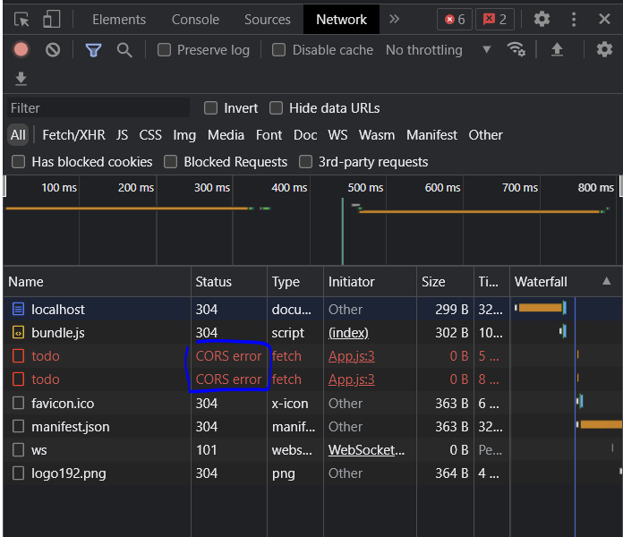
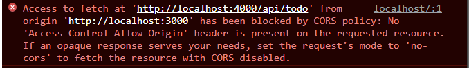
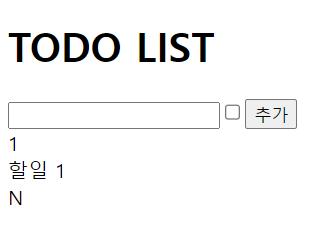

# Fetch

client폴더, server폴더 생성

- server 폴더 생성

    - 서버폴더로 이동

        `$ cd server`

    - package.json 설치

        `$ npm init`

    - 익스프레스 설치

        `$ npm i express`
    

    <br/>

    https://www.npmjs.com/search?q=express


    - 샘플코드 app.js 복붙

    ```
    const express = require('express')
    const app = express()

    app.get('/', function (req, res) {
    res.send('Hello World')
    })  

    app.listen(3000)
    ```

    - app.js 실행

        `$ node app.js`

    http://localhost:3000/

    - todoList API서버 만들기

        express에서 바디에서 데이터를 꺼내쓰려면 body-parser가 필요하다.

    - Postman을 이용해 post, get 하기
        - post localhost:3000/api/todo
            
            postman에서 body에 삽입하고 post로 send요청

        ```
        {
        "text" : "todo2",
        "done" : true
        }
        ```

        
        ERROR => TypeError: Cannot destructure property 'text' of 'req.body' as it is undefined.

        ```
        app.use(express.json())
        ``` 

        위에것 삽입하고 나니 해결됨

        - get으로 변경하면 데이터 들어간 것을 확인 할 수 있음.

    - 프론트 코드 짜기 시작

        - 클라이언트 폴더로 이동해서 React 사용

        ```
        $ cd ../client
        $ npx create-react-app .
        ```
        
        - 밑 4개 폴더 삭제

            - App.css 
            - App.test.js
            -  index.css
            - logo.svg


        - 기본제공하는 api는 fetch이고, axios라는 라이브러리 둘다 사용해본다.

------------------------------

서버에서 데이터를 요청하려면 **서버주소**와 어떤 **HTTP Method**가 필요한지 알아야한다.

서버 post주소를 4000으로 바꾸어준다 

fetch 사용하기 방법
<https://developer.mozilla.org/ko/docs/Web/API/Fetch_API/Using_Fetch>


---------------------------------

CORS_Error

CORS : cross origin resource sharing





Client : localhost:3000(react 개발 서버)
Server : localhost:4000

서로 오리진(host와 port를 포함한 데이터의 출처)이 다르다. (port가 다르기 때문에)

오리진이 다르면 데이터를 꺼내갈 수 없다.

CORS정책 허용은 server에서 진행해야한다.

<https://www.npmjs.com/package/cors>

```
$ npm install cors
```
설치한 후 밑에 코드 삽입 ( 옵션이 없으면 어떤 오리진이든 데이터를 꺼내갈 수 있다라고 허용하는 것 )

```
var cors = require('cors') // import하는것 (var말고 const로 바꿔주자)
app.use(cors())
```

-----------------------


react컴포넌트는 상태가 바뀌면 리랜더링이 된다. (코드를 다시실행시킨다)

fetch가 리랜더링 될때마다 실행되는것은 좋지 않다 => useEffect쓰자

------------
**과정 1**




----------------
 - axios 사용하기

    ```
    $ npm i axios
    ```
    App.js에 추가
    ```
    $ import axios from 'axios';
    ```

    복잡하다면 async await 문법 사용
    => then으로 표기했던 부분을 리턴값을 받아서 처리할 수 있게 된다.
-----------------------

react-query라는 라이브러리를 사용하면 더 쉽다.

-------------------------

kakao_login


<https://www.youtube.com/watch?v=Re2R2rid1K4>

<https://developers.kakao.com/>

내 애플리케이션 새로 만들고
JavaScript 키	8e657b1c493ad50c483a32602f746d69 이런식으로 가져오기

```
<script src="https://t1.kakaocdn.net/kakao_js_sdk/${VERSION}/kakao.min.js"
  integrity="${INTEGRITY_VALUE}" crossorigin="anonymous"></script>
  ```